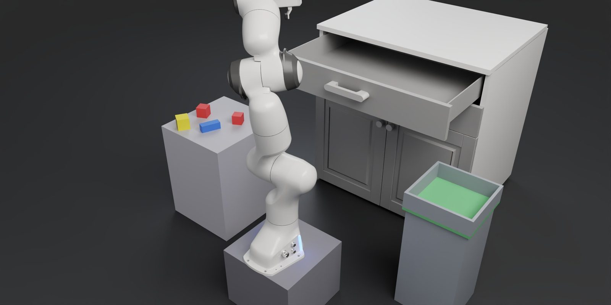
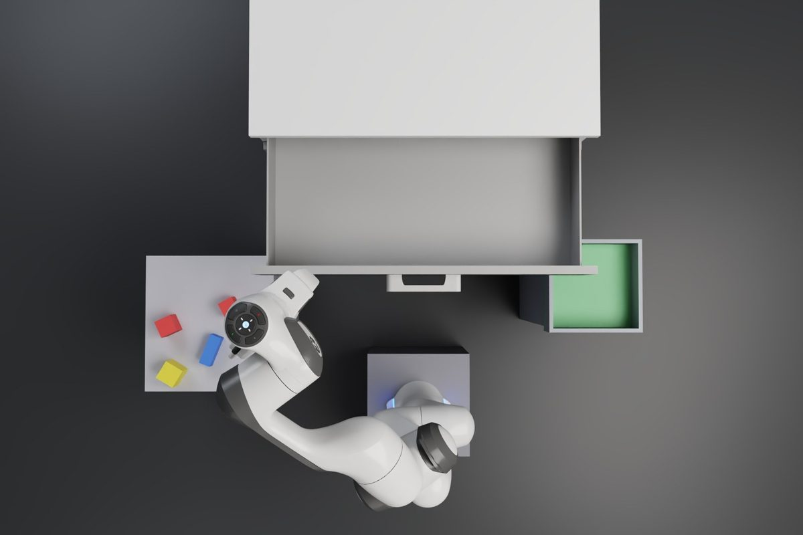
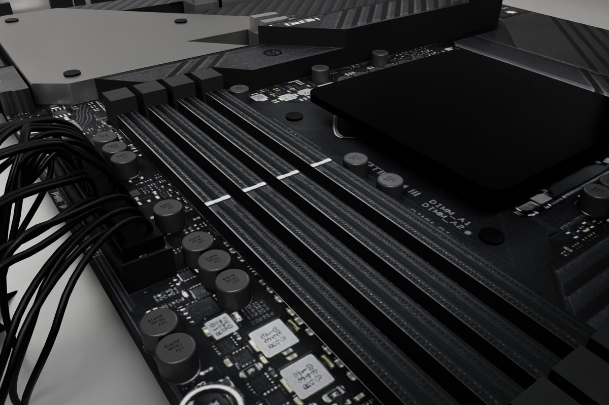
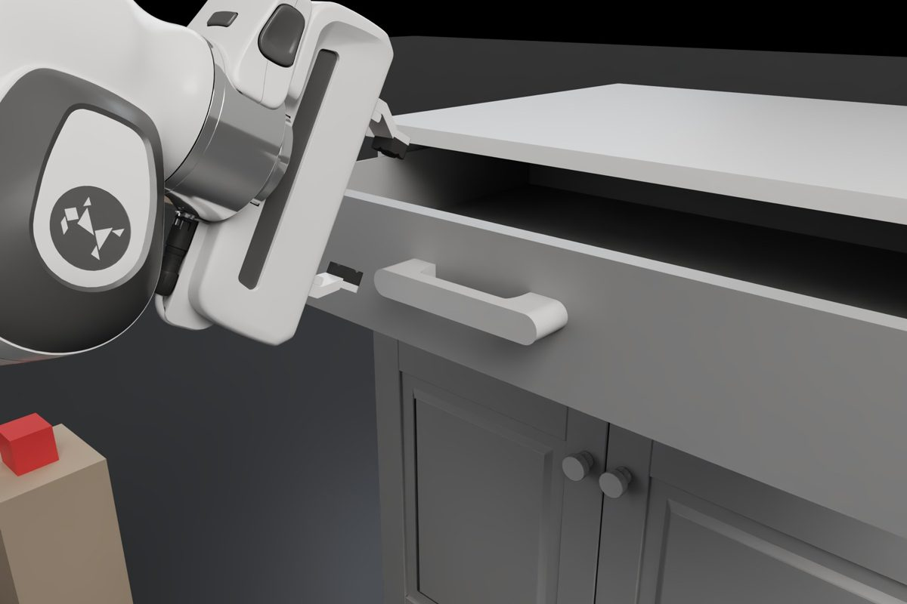

# VINCI Embodied AI Workshop

A 2-hour hands-on workshop on learning robotics, entirely in simulation: a Franka robot arm in NVIDIA Isaac Sim, a guided notebook, then a team challenge. It was run on 5 October 2026 for VINCI with 10 teams, designed and run by Reflexion Robotics.



| Part | Duration | What participants do |
|---|---|---|
| I. Guided notebook | ~45 min | a first gesture, reinforcement learning (RL), imitation (BC), perturbations and DAgger, vision-language-action model (VLA), world model, a first agent |
| II. Team challenge | ~55 min | "put the workstation back in order": program the robot's *Brain* (`team/brain.py`) and measure every change with `./evaluate.sh` |
| Wrap-up | ~20 min | teams submit (`./submit.sh`), read their score (`./submit.sh --status`) and present their measured improvement; the facilitator announces the ranking |

<p align="center">
  
  
</p>
<p align="center"><sub>The workstation seen from above (part II) · a learned vision policy inserting a RAM stick (part I)</sub></p>

## Three ways to run it

| You want to… | Use | Time |
|---|---|---|
| **Do the workshop on your own machine** (Ubuntu + NVIDIA RTX GPU) | [`install/`](#a--on-your-own-gpu-machine) | ~1 h install, once |
| **Try the team challenge on any laptop, no GPU** (Linux, macOS, Windows) | [`cpu/`](cpu/README.md): CPU edition with MuJoCo | ~5 min install |
| **Host the full event on AWS** (one GPU machine per team, opened in a browser) | [`deploy/`](#b--a-full-event-on-aws) | ~1 h 30 image build, then ~15 min per event |
| **Host it on Microsoft Azure** | [`docs/AZURE.md`](docs/AZURE.md) (NV36ads A10 v5, GRID driver 580) | ~1 h 30 for the first machine |
| **Host it on another cloud provider** | [`docs/OTHER_CLOUD.md`](docs/OTHER_CLOUD.md) | depends on the provider |

## Requirements

The simulator is **NVIDIA Isaac Sim 5.1 + Isaac Lab 2.3.2**. It needs:

- **Ubuntu 22.04 x86_64** (tested). Windows and WSL are not supported by this workshop.
- **An NVIDIA GPU with RT cores**: GeForce/Quadro RTX, L4, L40S, A10, A40… **A100, H100 and V100 do not work** (no RT cores, Isaac Sim cannot render).
- **24 GB of GPU memory recommended** (measured: 9.4 GB at rest, 17.6 GB at peak with both scenes and a training run). 12-16 GB is enough for the guided notebook.
- **32 GB of RAM**, ~60 GB of free disk, 8+ CPU threads.
- **NVIDIA driver 580.** Isaac Sim 5.1 crashed at start-up with driver 595 in our tests. On Ubuntu: `sudo ubuntu-drivers install nvidia:580` (or NVIDIA's 580 installer), then reboot.

`./install/check_machine.sh` checks all of this in a few seconds, without installing anything.

No GPU? The **CPU edition** ([`cpu/`](cpu/README.md)), added after the workshop, runs **the team challenge only** on any laptop with the MuJoCo physics engine: same workstation, same team files and Brain API, same scoring (starter brain 8/8, 80/100 in about a minute on a laptop). The guided notebook, the trained models (RL, DAgger visual student, RAM insertion) and the coding-agent robot tools need Isaac Sim, so a machine like the above. All the differences are listed in [`cpu/README.md`](cpu/README.md).

## A — On your own GPU machine

```bash
git clone https://github.com/charbelsan/embodied-ai-workshop.git && cd embodied-ai-workshop
./install/check_machine.sh      # verdict: READY / READY WITH LIMITS / NOT SUPPORTED, with the reason for each line
./install/install.sh            # once, ~30-60 min, ~30 GB downloaded; asks for sudo
cd ~/vinci-workshop && ./start.sh
```

`install.sh` downloads the models and videos of this release (~22 MB, checksums pinned in `RELEASE.json`), installs Isaac Sim 5.1 + Isaac Lab 2.3.2 in `/opt/isaac-venv`, the read-only workshop engine in `/opt/vinci-workshop` and **your workspace in `~/vinci-workshop`**. It does not touch your NVIDIA driver or your desktop. Options: `--with-agents` (also installs the Claude Code and Codex command-line tools; you log in with your own account), `--no-vscode`, `--no-warmup`.

`./start.sh` starts the two simulator scenes and opens the guided notebook (`notebooks/01_guided_lab.ipynb`) in your browser. The workshop sheet (`WORKSHOP_SHEET.pdf`, 2 pages) gives the overview. Then:

- **Part I:** follow the notebook, cell by cell.
- **Part II:** read the challenge sheet (`CHALLENGE_SHEET.pdf`, 2 pages; the detailed `CHALLENGE_GUIDE.pdf` lists every setting and call), edit `team/` in VS Code, and run `./evaluate.sh` in a terminal.
- **Optional expert challenge:** `notebooks/02_defi_expert_v2.ipynb` and `EXPERT_CHALLENGE.md`.

`./evaluate.sh` gives your score at any time. `./submit.sh` freezes your version and evaluates it on the 8 ranking episodes in the background; `./submit.sh --status` shows its score.

Start again from scratch: `./reset.sh --all` (your work is archived in `results/archive_…`, nothing is deleted).

To check an installation end to end (~10 min, run it right after installing, before changing `team/`): `scripts/smoke_test.sh` from the repository folder. On our reference home-like machine (NVIDIA L4 24 GB, 8 vCPU, 30 GiB, driver 580): the guided notebook ran without error, live cameras, the PC scene, evaluation 8/8 at 80/100, then 90/100 with verification enabled. The remote-desktop (DCV) checks are skipped on a single machine.

## B — A full event on AWS

Each team gets its own GPU machine (g6e, NVIDIA L40S), opened in a plain browser through Amazon DCV: participants install nothing.

**Account prerequisites**
- An AWS account in a region with **g6e** instances (us-east-1, us-east-2, us-west-2, eu-west-1…).
- **Quota** "Running On-Demand G and VT instances": 16 vCPU per machine, i.e. **192 vCPU for 10 teams + 2 spares**. Request it several days in advance (Service Quotas).
- On the organizer's computer: `bash`, AWS CLI v2 (EC2, IAM, S3, SSM rights), `openssl`, `python3`.

**Cost** (on-demand, us-east)

| Item | Value |
|---|---|
| Team machine | **g6e.4xlarge** (1 × L40S 48 GB, 16 vCPU, 128 GiB), ~3.0 $/h; automatic fallback to g6e.8xlarge (~4.5 $/h), then g6e.2xlarge |
| Typical day | 12 machines × 4.5 h ≈ **160 $** |
| Image build | 1 machine × ~1 h 30 ≈ 5 $ |
| Stored image | ~100 GB of snapshot ≈ 5 $/month (delete it after the event) |
| Venue network | ~0.7 Mbit/s per team on average, 7 Mbit/s peak: plan **≥ 70 Mbit/s down for 10 teams** |

On event day, g6e capacity can run out in an availability zone: start the machines a few hours early and keep `g6e.8xlarge` in `INSTANCE_TYPES`.

**From zero to the team URLs**

```bash
# 0. the repository and its models
git clone https://github.com/charbelsan/embodied-ai-workshop.git && cd embodied-ai-workshop
scripts/fetch_assets.sh

# 1. settings: region, instance types, venue network, optional bucket for team outputs
cp deploy/config.env.example deploy/config.env && $EDITOR deploy/config.env

# 2. account (once): security group, machine role, SSH key, bucket
deploy/setup_account.sh

# 3. workshop machine image (~1 h 30, once; rebuild after any change to the workshop)
deploy/build_image.sh

# 4. participants' network access (the venue's outgoing network), on event day
deploy/allow_cidr.sh add 203.0.113.0/24        # or, as a last resort: deploy/allow_cidr.sh open

# 5. team machines: ready in ~5-15 min
deploy/team.sh create-all 10
deploy/team.sh status                          # "t01 READY — https://<ip>:8443 (user vinci-t01) ..."

# 6. give each team its URL + user + password
deploy/team.sh credentials                     # deploy/state/credentials_*.csv, chmod 600: never share this file publicly
```

Teams also receive the workshop sheet (`participant/workspace/WORKSHOP_SHEET.pdf`: getting in, the desktop, the two hours; print it and write each team's address, username and password on it, or hand them a separate card), `participant/PARTICIPANT_ACCESS.md` (how to connect, certificate warning) and the challenge sheet (`participant/workspace/CHALLENGE_SHEET.pdf`, 2 pages, also as `CHALLENGE_SHEET.md`; detailed guide: `CHALLENGE_GUIDE.pdf`).

**What a team sees:** the DCV desktop with Isaac Sim already open and the icons **START WORKSHOP**, Isaac Sim, Jupyter Lab, VS Code (on `team/`), Terminal, Results, Challenge sheet, **RESTART WORKSHOP**.

**During the workshop**

| Need | Command |
|---|---|
| State of every machine | `deploy/team.sh status` (every 15 min) |
| A team broke everything | `deploy/team.sh reset t03` (~75 s), then the team clicks START WORKSHOP |
| Black screen, machine unreachable | `deploy/team.sh destroy t03 --no-save` then `deploy/team.sh create t03` (~5-15 min, **new password**) |
| End-to-end check of a machine | `deploy/team.sh ssh t03 'bash -s' < scripts/smoke_test.sh` (~10 min, exit code 0 expected) |
| Access refused from the venue | `deploy/allow_cidr.sh list`, then `add` the right network |
| Collect the scores at the end | each team runs `./submit.sh --status` and reads its **best valid score** (8 DEV episodes, seeds 0 to 7) |

**Stop and clean up — do not forget, GPU machines are billed by the second**

```bash
deploy/team.sh stop all                 # pause: only the disks are billed; the URL changes on restart (team.sh start all)
deploy/team.sh destroy all              # verified copy of team outputs to OUTPUT_BUCKET, then deletion
deploy/cleanup_account.sh --all         # after the event: images, snapshots, security group, role
```

## C — Another cloud provider

`deploy/` automates AWS only, but the machine installer is plain Ubuntu. **Azure:** [`docs/AZURE.md`](docs/AZURE.md) (VM size, Azure's GRID driver 580, image and one machine per team, `vinci-team-init`). **Any other provider:** [`docs/OTHER_CLOUD.md`](docs/OTHER_CLOUD.md) for the GPU choice, the remote desktop, and the three things to adapt.

## Repository layout

```text
install/        your own GPU machine: check_machine.sh, install.sh
deploy/         AWS: account, machine image, team machines, network access, cleanup
workshop/       machine installer: base stack (driver, desktop, DCV), Isaac Sim (install_isaac.sh), the workshop
participant/    what teams see (workspace/) and the workshop engine (runtime/, installed read-only)
scripts/        assets download and verification, smoke test, model regeneration
docs/           Azure, other providers, images
cpu/            CPU edition of the team challenge (MuJoCo, any laptop)
```

## Models and notebook results

<p align="center"></p>

The trained policies (RL, DAgger visual student and teacher, RAM insertion student) and the notebook videos are a release asset, downloaded by `scripts/fetch_assets.sh` and verified against `RELEASE.json`. To rebuild them yourself on a workshop machine: `scripts/regenerate.sh rl | dagger | demos | lerobot | smolvla` (~10 min to ~1 h per step, measured durations in the script header). The RAM insertion student is not regenerated from this repository (its chain needs ~40 min on 8 parallel simulators); its sha256 is checked at every load.

Measured references: visual DAgger student 99.2 % on 128 perturbed episodes vs 1.6 % with swapped images; the skill 20/20 in the workshop scene; a coding agent as Brain through MCP 10/10; RAM insertion 18/20 through the scene server.

## Troubleshooting

| Symptom | Cause and fix |
|---|---|
| `check_machine.sh`: GPU NO | no NVIDIA driver, or a GPU without RT cores (A100/H100): use an RTX-class GPU |
| Isaac Sim crashes at start-up (`Segmentation fault`, `rtx.scenedb` in the log) | install NVIDIA driver **580** (newer 59x drivers crashed in our tests), reboot, run `./start.sh` again |
| `team.sh create`: `InsufficientInstanceCapacity` everywhere | no g6e capacity in the region: retry 20-30 min later, allow other AZs (`AZS=`), add `g6e.8xlarge`, or another region |
| `VcpuLimitExceeded` | G/VT quota too low (see account prerequisites) |
| Certificate warning in the browser | normal (self-signed certificate): see `participant/PARTICIPANT_ACCESS.md` |
| The notebook cannot reach the simulator | START WORKSHOP (`./start.sh`) restarts it; on AWS, `deploy/team.sh reset tNN` |
| A team can no longer evaluate | `./reset.sh --team` restores the starter Brain (the old one is kept in `results/`) |

## Versions

See [VERSIONS.md](VERSIONS.md) to restore a version with its exact models. `RELEASE.json` pins the checksum of every file and of the asset archive.

## License

The workshop code and content are under the [Apache License 2.0](LICENSE). Isaac Sim, Isaac Lab, LeRobot, SmolVLA, RSL-RL and the robot assets keep their own licenses and are installed from their official sources, not redistributed: see [NOTICE](NOTICE). Using Isaac Sim requires accepting the NVIDIA Omniverse License Agreement.
