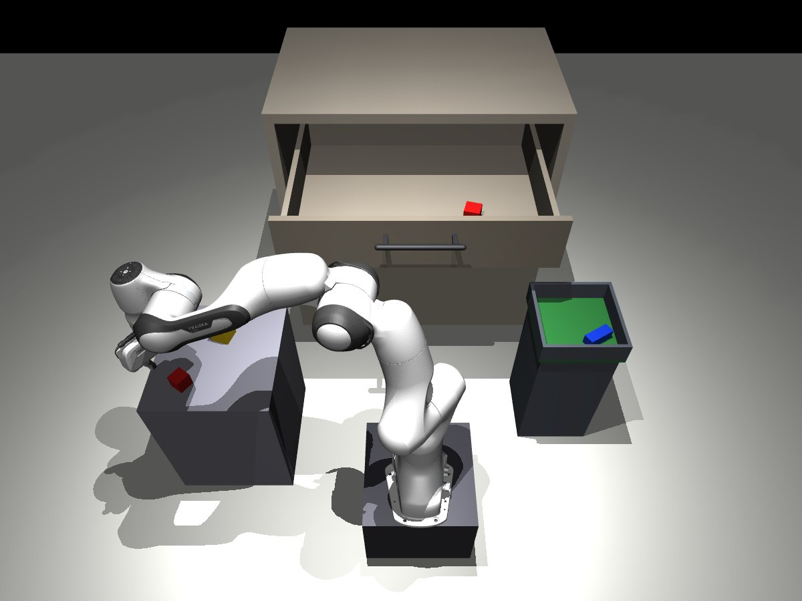

# CPU edition — the team challenge on any laptop

No NVIDIA GPU? This folder runs the workshop's **team challenge** ("put the workstation back in order") on a plain CPU, with the [MuJoCo](https://mujoco.org) physics engine instead of NVIDIA Isaac Sim. Linux, macOS and Windows, Python 3.10 to 3.13, about 4 GB of RAM.



**What this edition is.** An addition made by Reflexion Robotics after the workshop, so that people without an NVIDIA GPU can still practise the team challenge. It reproduces what can reasonably run on a CPU; it is **not** the full workshop. The full workshop (guided notebook, learned models, RAM insertion, coding-agent tools) needs NVIDIA Isaac Sim, hence an RTX-class GPU: see the main README.

Measured on a laptop without GPU (8 threads): the starter brain scores **8/8 successes, 80.0/100 in about 1 minute**, and **90.0/100** once `verification.enabled: true` is set, the same averages as the GPU edition.

## Same as the GPU workshop

- The workstation layout: Franka arm on its pedestal, work table, kitting tray, cabinet with a sliding top drawer, the four parts and the work order.
- The levels `training` and `dev` with the same randomization: positions, yaw, frictions, masses, drawer damping, sticky drawer (10 %), a part slipping during transport (10 %).
- Your team files (`team/brain.py`, `team/skills.py`, `team/config.yaml`) and the Brain API: `tools.rules()`, `tools.inspect()`, `tools.call(...)` with the same skills and arguments, `tools.time_left()`, `tools.decide()`, `tools.config`. A brain that works through `tools` runs unchanged in both editions.
- The scoring: the same grader code, the same 0-100 score and components, the same 8 DEV episodes (seeds 0 to 7), the same report.

## Different, because the physics engine is different

| | GPU edition (Isaac Sim, PhysX) | CPU edition (MuJoCo) |
|---|---|---|
| Physics | NVIDIA PhysX | MuJoCo: the same seed does not give exactly the same episode; averages match (80, then 90 with verification), failure rates may differ (18/20 on 20 CPU episodes) |
| Cabinet | IKEA Sektion model shipped with Isaac Lab | a simple box cabinet of the same size; horizontal handle bar |
| Gestures | as designed for Isaac | ported and adapted to the MuJoCo arm: transport at 0.86 m instead of 0.96 m, lift in two stages, drawer pulled 0.28 m instead of 0.33 m, drawer closed by pushing its face beside the handle, 70 N gripper |
| Simulated time per episode | about 107 s | about 80 s |
| Camera images in `tools.lab.observe()` | RGB 256×256, on when a camera-based provider is selected | RGB 128×128, on only with `--videos` |
| Low-level `tools.lab` | torch tensors, full lab API | numpy arrays, a subset with the same names (`observe`, `move_to`, `move_joints`, `gripper`, `hold`, `ee_pose`, `drawer_opening`…) |
| Watching the robot | Isaac Sim window in the remote desktop | `--view`: a MuJoCo window on your computer |
| Videos | MP4 | animated GIF (MP4 if you also `pip install imageio imageio-ffmpeg`) |

## Not possible without a GPU

These parts depend on NVIDIA Isaac Sim itself, or on models trained inside it: their observations, rendering and scene do not exist in MuJoCo.

- **Isaac Sim and Isaac Lab** (RTX rendering, GPU-parallel environments).
- **The trained models of the workshop**: the RL drawer policy (`rl` provider), the DAgger visual student (`visual` provider) and the RAM-insertion student. They were trained on Isaac's scene and Isaac's camera images and do not transfer to this MuJoCo scene.
- **The guided notebook (part I)**, which drives Isaac Lab: live RL training, BC/DAgger with the cameras, perturbations, the pre-recorded VLA and world-model results presented next to live Isaac runs.
- **The PC scene** (RAM insertion), and the **expert challenge** (notebook 02, `expert.sh`) built on the learned policies.
- **The coding-agent robot tools** (MCP server `vinci-robot`: `observe`, learned `open_drawer`, `insert_ram`), which talk to the Isaac scene servers. A coding agent can still help you edit `cpu/team/`.

## Not included in this edition

Possible in principle on a CPU, but not part of this edition:

- `./train.sh` (retraining RL or DAgger) and model selection: the `checkpoints:` section of `config.yaml` is ignored.
- `./submit.sh` and `--status`: here your score is the result of `python cpu/evaluate.py` on the same 8 DEV episodes.
- The workshop desktop: START WORKSHOP and RESTART WORKSHOP icons, preinstalled VS Code, `start.sh`, `reset.sh`.

## The challenge sheet, translated for the CPU edition

The challenge sheet (`participant/workspace/CHALLENGE_SHEET.md`) and the team README (`cpu/team/README.md`) were written for the GPU workshop. With the CPU edition:

| The sheet says | In the CPU edition |
|---|---|
| `./evaluate.sh` (and `--episodes`, `--videos`, `--level`) | `python cpu/evaluate.py` with the same options, plus `--view` |
| `./submit.sh`, "check the result in the portal" | not available: your score is `python cpu/evaluate.py` (8 DEV episodes, seeds 0-7) |
| `./train.sh rl`, `./train.sh dagger`, `./train.sh select` | not available |
| `./reset.sh` | not needed: every episode starts from a reset scene |
| `./reset.sh --team`, RESTART WORKSHOP | delete `cpu/team/`, then `python cpu/setup_cpu.py` |
| START WORKSHOP, VS Code and Terminal icons | any editor on `cpu/team/`, any terminal |
| providers `rl` / `visual` for `open_drawer` | `analytic` only (already set by `setup_cpu.py`) |
| `tools.lab.observe()["rgb_front"]` during `./evaluate.sh` with `visual` | only with `python cpu/evaluate.py --videos N` |
| coding agent + `vinci-robot` MCP tools (`AGENTS.md`) | agent for editing code only; no robot tools |

## Install (once)

From the repository folder:

```bash
python -m venv .venv-cpu && source .venv-cpu/bin/activate      # Windows: .venv-cpu\Scripts\activate
python -m pip install -r cpu/requirements.txt
python cpu/setup_cpu.py      # downloads the robot model (~34 MB) and creates your team in cpu/team/
```

## Play

```bash
python cpu/evaluate.py                  # 8 DEV episodes, prints your score and what went wrong
python cpu/evaluate.py --view           # watch the robot in a window (real time, one process)
python cpu/evaluate.py --episodes 20    # more episodes, more reliable
python cpu/evaluate.py --videos 2       # also save 2 episodes as animations in cpu/results/ (slower: ~2-3 min each)
python cpu/evaluate.py --level training # the 1-piece warm-up level
```

Then follow the challenge sheet (`participant/workspace/CHALLENGE_SHEET.pdf` or `.md`, with the translation table above): measure, change **one** thing in `cpu/team/`, measure again. The first easy gain: in `cpu/team/config.yaml`, set `verification: enabled: true` (80 → 90/100). The next ones are yours: inspect after each action, retry with a limit, verify the final state (see `cpu/team/README.md`).

Every run is kept in `cpu/results/run_…/` (`report.txt`, and the trace of every decision and skill call in `episodes/episodes.jsonl`); `cpu/results/latest` points to the last one. To start again from the starter team: delete `cpu/team/` and run `python cpu/setup_cpu.py` again.

## Troubleshooting

| Symptom | Fix |
|---|---|
| `ensurepip is not available` (Ubuntu) | `sudo apt install python3-venv`, then create the environment again |
| `missing package` | `python -m pip install -r cpu/requirements.txt` in the activated environment |
| `Franka model missing` | `python cpu/setup_cpu.py` (needs internet once) |
| `--view` or `--videos` fails on a server without a screen | run without them, or set `MUJOCO_GL=egl` (NVIDIA/EGL) or `MUJOCO_GL=osmesa` (CPU rendering, `apt install libosmesa6`) for videos |
| `provider 'rl' is not available in the CPU edition` | in `cpu/team/config.yaml`: `open_drawer: analytic` |

## Credits

MuJoCo (Apache-2.0) by Google DeepMind. Franka Emika Panda model from [MuJoCo Menagerie](https://github.com/google-deepmind/mujoco_menagerie) (Apache-2.0), downloaded at a pinned commit by `setup_cpu.py`, not redistributed here.
